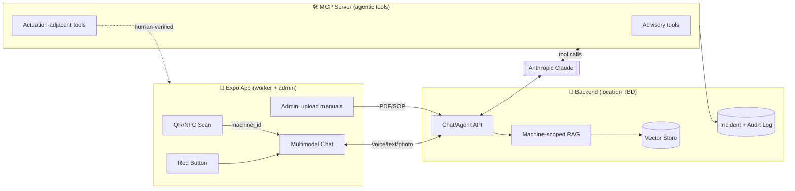

# Red Button — Architecture & Plan

AI-powered emergency assistant for industrial safety. Hack For Good submission.

> Stack is pinned to **Expo SDK 57** (React Native 0.86, React 19.2). Always consult
> https://docs.expo.dev/versions/v57.0.0/ before writing Expo code.
> LLM/RAG provider: **Anthropic Claude**. Demo targets: **Android + all-Expo (iOS/web via Expo)**.

---

## 1. System Overview

Three cooperating pieces:



**Flow in an emergency:**
1. Worker scans machine QR/NFC → app captures `machine_id` + `location`.
2. Worker hits the **Red Button** → opens multimodal chat scoped to that machine.
3. Input (voice → transcript, text, or photo/video) goes to the backend.
4. Backend runs **machine-scoped RAG**, sends retrieved chunks + query to **Claude**.
5. Claude answers **only from cited documentation**; if confidence is low it **escalates to a human** instead of guessing.
6. Claude may invoke **MCP tools** — advisory ones autonomously, actuation-adjacent ones only with human verification, everything logged.

---

## 2. Design Principle — Advisory vs Actuation-Adjacent

| Class | Autonomy | Examples | Guardrails |
|---|---|---|---|
| **Advisory** | Agent calls autonomously | retrieve docs, summarize, draft report | Cited, logged |
| **Actuation-adjacent** | Human-verifiable, always logged | escalate, protocols, dispatch, notify, backup | Confirm step, immutable audit trail, severity gate |

This keeps the system **fast in a crisis** while staying **safe and auditable**.

---

## 3. MCP Server — Tool Contracts

### Live Escalation (actuation-adjacent)
| Tool | Args | Behavior |
|---|---|---|
| `escalate_to_human` | `summary, severity, machine_id, location` | Pushes a **live, continuously updating** conversation summary to the on-site safety officer (not a one-shot alert). |
| `trigger_emergency_protocol` | `protocol_type` (fire\|gas\|entrapment\|chemical) | Fires factory systems: alarms, sprinklers, evac announcements. |
| `call_emergency_services` | `type, location` | Dispatch with location + context pre-filled. |
| `notify_nearest_workers` | `location, radius, message` | Real-time warning to nearby workers. |
| `request_backup` | `role, skill` | Pings nearest qualified technician/electrician/first-aid worker. |

### Post-Incident (advisory)
| Tool | Args | Behavior |
|---|---|---|
| `schedule_debrief` | `incident_id` | Auto-schedules the retro. |
| `generate_incident_report` | `incident_id, format` | Drafts OSHA-style report from transcript + logged data, for human sign-off. |

Each tool call records: `timestamp, caller, args, result, human_verifier?` to the audit log.

---

## 4. App Structure (Expo SDK 57, expo-router, `src/`)

```
src/
  app/
    _layout.tsx                # root providers + theme
    index.tsx                  # RED BUTTON home (large tap target)
    scan.tsx                   # QR/NFC machine scan → sets machine scope
    chat/
      [machineId].tsx          # multimodal emergency chat, scoped to machine
    admin/
      _layout.tsx
      index.tsx                # admin dashboard
      manuals.tsx              # upload/manage manuals & SOPs
      incidents.tsx            # incident log + reports
  components/
    red-button.tsx             # the hero control (haptics + hold-to-confirm)
    chat/                      # message list, composer, voice recorder, photo attach, citation card
    citation-card.tsx          # shows grounded source + page
    confidence-banner.tsx      # "escalating to a human" state
  features/
    rag/                       # client for chat/agent API
    machine-scope/             # machine_id + location context
    audio/                     # record (expo-audio) + speak (expo-speech)
  services/
    api.ts                     # backend client
    mcp-client.ts              # (if app talks to MCP through backend)
  constants/
  hooks/
```

### Expo SDK 57 packages to add (via `npx expo install`)
| Need | Package |
|---|---|
| QR scan | `expo-camera` (`CameraView` barcode scanning) |
| NFC | `react-native-nfc-manager` (dev build; not Expo Go) |
| Voice capture | `expo-audio` |
| Text-to-speech | `expo-speech` |
| Photo/video pick | `expo-image-picker`, `expo-video` |
| Location context | `expo-location` |
| Haptic red button | `expo-haptics` |
| Secure config/token | `expo-secure-store` |
| Push to safety officer | `expo-notifications` |
| Manual upload | `expo-document-picker`, `expo-file-system` |
| Local incident cache | `expo-sqlite` |

> `expo-camera`, `expo-audio`, `expo-location`, NFC, notifications need a **Dev Client build**
> (`npx expo run:android`) — several won't work in Expo Go.

---

## 5. Backend & RAG (location TBD — "wait for it")

Decoupled behind `services/api.ts` so the app is agnostic. Candidate shapes:
- **Separate `/server`** (Node/TS) in this repo, or
- **Expo API routes** (`expo-server`, SDK 57), or
- external service.

RAG pipeline (provider-agnostic, Claude for generation):
1. **Ingest**: admin uploads PDF/SOP → chunk → embed → store with `machine_id` metadata.
2. **Retrieve**: query filtered by scanned `machine_id` (machine-scoped retrieval).
3. **Generate**: Claude with a strict system prompt — *answer only from provided sources, cite them, and if insufficient, return low confidence*.
4. **Confidence gate**: below threshold → trigger `escalate_to_human` instead of answering.
5. **Agent loop**: Claude tool-use ↔ MCP server; actuation-adjacent tools require confirm.

---

## 6. Safety, Security & Compliance
- **No hallucinated safety instructions** — every answer carries citations; ungrounded → escalate.
- **Immutable audit log** for every MCP tool call (who/what/when/result/verifier).
- **Human verification** required for all actuation-adjacent tools.
- **Least privilege**: MCP tools authenticated; app never holds emergency-system credentials directly.
- **Offline resilience**: cache last-known machine SOPs locally (`expo-sqlite`) for connectivity gaps.

---

## 7. Build Order (proposed)
1. App shell: Red Button home + machine scan + scoped chat UI (mocked backend).
2. Multimodal input: voice record/transcribe, photo attach, TTS playback.
3. Citation + confidence-gate UI.
4. Backend + RAG ingest/retrieve (once location decided).
5. MCP server with the 7 tools + audit log.
6. Agent loop wiring (Claude ↔ MCP) with human-verify on actuation tools.
7. Admin: manual upload + incident log + report generation.

_Current status: Expo SDK 57 app scaffolded. Backend location pending your input._
```
